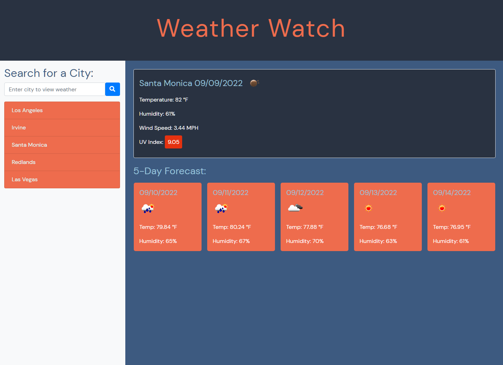

# Weather Watch

Weather Watch is an essential and simple-to-use weather forecast application for all of your activities and daily use.

## Description

This application is a fully featured weather scouting app that showcases the use of several different APIs in order to create a convenient and easy-to-use application for every-day weather needs. This app logs the last viewed user-inputted city into local storage for simple and recurring day-to-day reference and shows information including: temperature, humidity, wind speed, and UV index. The app also has cards that display a five day forecast of the selected city.

## Image of Webpage

## Link of Webpage

https://sam-t-g.github.io/Weather-Watch/

## License

MIT License

Copyright (c) 2022 Samuel Gerungan

Permission is hereby granted, free of charge, to any person obtaining a copy of this software and associated documentation files (the "Software"), to deal in the Software without restriction, including without limitation the rights to use, copy, modify, merge, publish, distribute, sublicense, and/or sell copies of the Software, and to permit persons to whom the Software is furnished to do so, subject to the following conditions:

The above copyright notice and this permission notice shall be included in all copies or substantial portions of the Software.

THE SOFTWARE IS PROVIDED "AS IS", WITHOUT WARRANTY OF ANY KIND, EXPRESS OR IMPLIED, INCLUDING BUT NOT LIMITED TO THE WARRANTIES OF MERCHANTABILITY, FITNESS FOR A PARTICULAR PURPOSE AND NONINFRINGEMENT. IN NO EVENT SHALL THE AUTHORS OR COPYRIGHT HOLDERS BE LIABLE FOR ANY CLAIM, DAMAGES OR OTHER LIABILITY, WHETHER IN AN ACTION OF CONTRACT, TORT OR OTHERWISE, ARISING FROM, OUT OF OR IN CONNECTION WITH THE SOFTWARE OR THE USE OR OTHER DEALINGS IN THE SOFTWARE.
